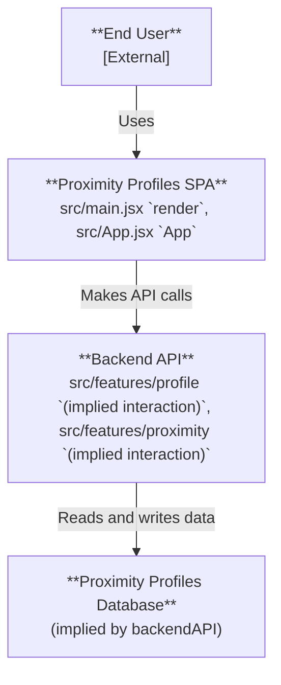

# Unnamed CodeViz Diagram

```mermaid
graph TD

    base.cv::user["**End User**<br>[External]"]
    base.cv::proximityProfilesSPA["**Proximity Profiles SPA**<br>src/main.jsx `render`, src/App.jsx `App`"]
    base.cv::backendAPI["**Backend API**<br>src/features/profile `(implied interaction)`, src/features/proximity `(implied interaction)`"]
    base.cv::profilesDB["**Proximity Profiles Database**<br>(implied by backendAPI)"]
    %% Edges at this level (grouped by source)
    base.cv::user["**End User**<br>[External]"] -->|"Uses"| base.cv::proximityProfilesSPA["**Proximity Profiles SPA**<br>src/main.jsx `render`, src/App.jsx `App`"]
    base.cv::proximityProfilesSPA["**Proximity Profiles SPA**<br>src/main.jsx `render`, src/App.jsx `App`"] -->|"Makes API calls"| base.cv::backendAPI["**Backend API**<br>src/features/profile `(implied interaction)`, src/features/proximity `(implied interaction)`"]
    base.cv::backendAPI["**Backend API**<br>src/features/profile `(implied interaction)`, src/features/proximity `(implied interaction)`"] -->|"Reads and writes data"| base.cv::profilesDB["**Proximity Profiles Database**<br>(implied by backendAPI)"]

```
---
*Generated by [CodeViz.ai](https://codeviz.ai) on 12/10/2025, 4:28:23 PM*
